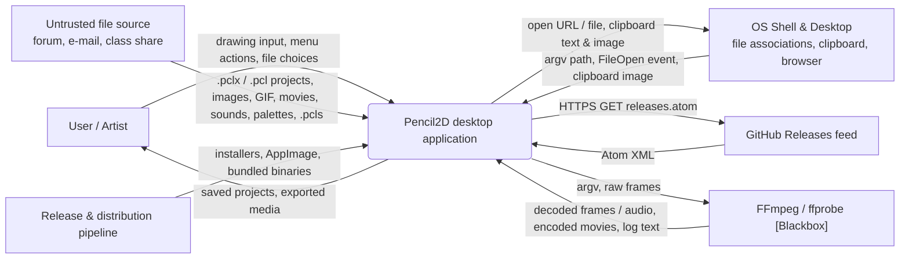
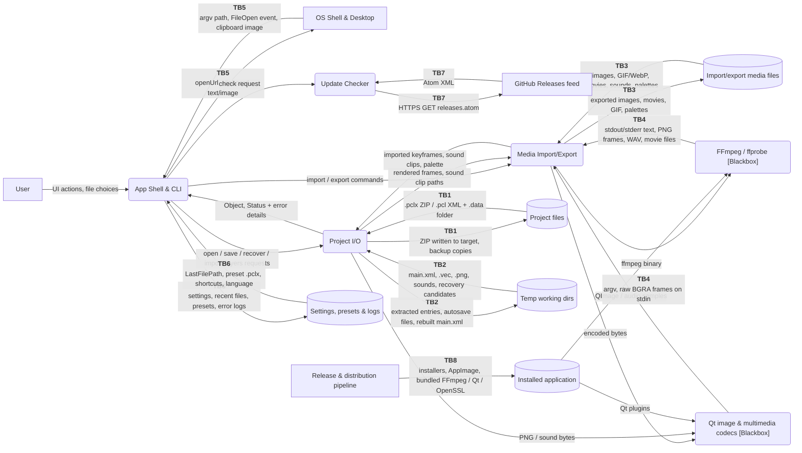
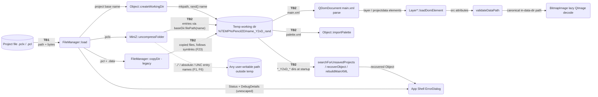
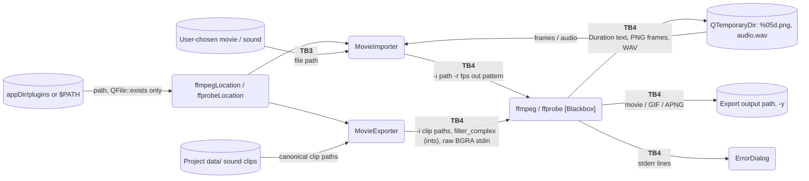

# Code Analysis: Pencil2D Desktop Application (v0.7.0-dev)

**Date**: 2026-09-23
**Author**: Generated by AI (Claude Code, code-analysis skill). Reviewed by: TBD
**Status**: Draft. Generated in one-shot mode, pending review.
**Scan depth**: full (architecture + code + dependency audit)
**Revision analysed**: `master` @ `1af647ebf` (2026-09-13)
**Attacker model**: `malicious-file`. A remote attacker with no local access persuades the user to open a crafted project (`.pclx`/`.pcl`) or to import a crafted media, palette or shortcut file. Other local users on a shared-`/tmp` system are noted only as secondary context.

---

## 1. Documentation

- Repository: `pencil2d/pencil` (local clone `D:\Github\pencil2d\pencil2d-work2`). The main modules analysed:
  - `core_lib/src/structure/`: document model, `FileManager`, layers, keyframes.
  - `core_lib/src/qminiz.*` and `miniz.*`: ZIP container.
  - `core_lib/src/graphics/`: bitmap and vector images.
  - `core_lib/src/movieimporter.*`, `movieexporter.*`, `soundplayer.*`, `managers/`: media and FFmpeg.
  - `core_lib/src/util/`: path validation, FFmpeg lookup, error details, settings.
  - `app/src/`: main window, CLI, dialogs, update check.
  - `core_lib/src/external/`: platform handlers.
- Build and release: `CMakeLists.txt`, `pencil2d.pro`, `util/common.pri`, `app/app.cmake`, `.github/workflows/ci.yml`, `.github/actions/*`, `util/installer/*.wxs`, `util/win-deploy.ps1`.
- Tests: `tests/src/test_util.cpp` (covers `validateDataPath`) and `tests/src/test_qminiz.cpp` (covers compression only).
- No external architecture documents were provided. Everything in this report comes from the source code.
- Dynamic evidence: a throwaway harness built from the repository's `miniz.cpp` plus a copy of the `MiniZ::uncompressFolder` logic was run against crafted ZIP files. It was built with Qt 5.15.2 and Qt 6.8.3 on Windows and confirmed finding F1. The app itself was not built or run.

---

## 2. Scope

**In scope**:
- Opening, parsing, saving, autosaving and crash-recovering projects: `.pclx` (ZIP) and legacy `.pcl` (XML plus a `.data` folder).
- Importing media: bitmap images and image sequences, animated GIF/WebP, vector `.vec`, movies, sounds, palettes (`.gpl` and XML), layers from another project.
- Exporting: images, image sequences, movies, GIF and APNG, and palettes.
- Using the external FFmpeg/ffprobe process: locating the binary, building arguments, piping data, parsing its output.
- The application shell: command-line export, OS file associations and `QFileOpenEvent`, clipboard exchange, `QDesktopServices` URL opening, the error, about and recovery dialogs.
- Persistent state: QSettings (recent files, last file, shortcuts, language, window state), presets, `.pcls` shortcut import, save-error logs, single-instance lock.
- The update check, which fetches the GitHub Releases Atom feed over HTTPS.
- Build, packaging and distribution: the CI workflows, bundled third-party binaries (Qt, FFmpeg, OpenSSL, GStreamer), code signing, and the installer's install scope.

**Out of scope**:
- Internals of Qt image plugins, Qt Multimedia backends (WMF/AVFoundation/GStreamer/FFmpeg) and FFmpeg decoders. These are treated as **[Blackbox]** components; only their interfaces and versions are assessed.
- Drawing tools, canvas painting, undo semantics and UI widgets, except where they consume data from a file.
- The pencil2d.org website, `get.pencil2d.org` and the `pencil2d-deps` repository. They are only referenced from CI.
- OS-level controls such as SmartScreen, Gatekeeper and AppArmor.

---

## 3. Assumptions

1. **Attacker model (anchor)**: The attacker is remote and has no foothold on the victim's machine. They deliver files through forums, e-mail, class assignments, tutorial downloads or shared drives, and the user opens or imports them with Pencil2D. The attacker controls every byte of the delivered file, including ZIP entry names, XML content and media payloads.
2. Pencil2D runs as a normal desktop process with the logged-in user's privileges. It has no sandbox; it is not a Flatpak, Snap or App Store build.
3. The Windows installer ships Qt 5.15.2 and installs per-user into `%LOCALAPPDATA%\Programs\Pencil2D` by default (`pencil2d.bundle.wxs:56`, `pencil2d.wxs:27`).
4. `%TEMP%` on Windows resolves to `%LOCALAPPDATA%\Temp`, the OS default. On Linux, `QDir::tempPath()` is the shared `/tmp`.
5. FFmpeg/ffprobe, the Qt image plugins and the Qt Multimedia backend are **[Blackbox]**. We assume they behave according to their public documentation and known CVE history for the shipped versions.
6. The GitHub Releases Atom feed and the pencil2d.org download page are trusted when reached over HTTPS with valid certificates.
7. No user accounts, authentication or network services exist in the application. "Identity" means the authenticity of files, executables, peers and release artifacts.
8. Release builds come from the qmake CI pipeline (`ci.yml:94-99`), so `QT_NO_DEBUG_OUTPUT` is defined in them. CMake/Qt 6 builds are used for development and AppVeyor only.

---

## 4. Technology Stack

| Category | Details |
|----------|---------|
| Languages | C++17, Objective-C++ (macOS glue), Qt `.ui` XML, Qt resources |
| Frameworks | Qt 5.15 / Qt 6.5+ (Core, Gui, Widgets, Xml/QDom, Svg, Multimedia, Network) |
| Build system | qmake (CI and releases, Qt 5 and Qt 6), CMake 3.21+ (Qt 6 only, dev and AppVeyor) |
| Dependencies | miniz 3.1.0 (vendored); Catch2 2.13.10 (tests only); external FFmpeg/ffprobe; OpenSSL 1.1.1w (Windows bundles); GStreamer (Linux AppImage) |
| Deployment | Windows MSI and Burn EXE (per-user, unsigned) plus portable ZIP; macOS DMG (codesigned and notarized); Linux AppImage with zsync (unsigned) |
| Bundled FFmpeg | Windows 4.1.1 (`pencil2d-deps`, no hash check); macOS 8.0.1 (evermeet.cx, GPG-checked with a key from the same host); Linux copied from the RPM Fusion package |

---

## 5. Asset Inventory

| # | Asset | Value | Description | Risk if Compromised |
|---|-------|-------|-------------|---------------------|
| A1 | Project artwork & document data | High | The user's animation: layers, keyframes, bitmap/vector frames, sounds, palette and project settings, both in memory and saved as `.pclx`/`.pcl` with `.backupN` copies. | Tampering or loss destroys hours to months of creative work. Corrupted saves or deleted working data may be impossible to recover. |
| A2 | User account files & execution context | High | Everything the user can write: home directory, `%APPDATA%` Startup folder, shell rc files, autostart entries, Documents. Also the ability to run code as the user. | Arbitrary file write here means persistent code execution as the user, ransomware-style damage, or complete account compromise. |
| A3 | Pencil2D installation & bundled executables | High | `pencil2d.exe`, Qt DLLs and plugins, and `plugins/ffmpeg(.exe)` in the install directory. The Windows install directory is user-writable. | A replaced binary or plugin runs attacker code every time the app starts or FFmpeg is invoked. The code runs under the Pencil2D name. |
| A4 | Temporary working directories & crash-recovery data | Medium | `%TEMP%/Pencil2D/<name>_Y2xD_<rand8>/` holds the extracted project, timed autosave output and crash leftovers. There are also QTemporaryDirs for movie and sound import and export. | Tampering changes what is loaded or recovered. Deletion loses unsaved work. On a shared `/tmp`, other users can read the artwork. |
| A5 | Application settings, presets & shortcuts | Low | QSettings (`Pencil/Pencil`): RecentFiles, LastFilePath, LoadMostRecent, Shortcuts, Language, WindowState. Also `AppData/presets/*.pclx` with `presets.ini`, and imported `.pcls` files. | Changes app behaviour at startup, such as auto-opening a file, silently loading a preset, or remapping keys. The impact is mostly nuisance and persistence. |
| A6 | Exported media outputs | Medium | Movies, GIF/APNG, image sequences and palettes written to paths the user chooses. FFmpeg runs with `-y`, so it overwrites without asking. | Wrong, partial or foreign content in deliverables. Existing files can be overwritten without warning. |
| A7 | Application availability | Medium | The ability to launch Pencil2D, open projects and work without crashes or hangs. | A crash or hang on open, repeated on every launch through recovery or auto-open, blocks the user's work. |
| A8 | User credentials & confidential local files | High | The Windows NTLM credential used for SMB authentication, and readable private files such as SSH keys and documents. | Credential theft enables lateral movement. Leaked private files can be exploited or published. |
| A9 | Diagnostic information | Low | The save-error log `AppLocalData/logs/error-*.txt`, the ErrorDialog and AboutDialog text, and qDebug output. These contain paths (and therefore user names), OS, kernel and locale, and layer names. | Minor privacy leakage when users paste the text into public bug reports. |
| A10 | Release artifacts & signing credentials | High | Installers, AppImages and DMGs; the bundled FFmpeg, OpenSSL and Qt; the Apple Developer ID `.p12` and notarization secrets; the docs deploy token. | A tampered release reaches every user who downloads it, and malware signed with the project's Developer ID is trusted by macOS. |
| A11 | Update check information | Low | The latest-version string from the GitHub Atom feed and the fixed download URL. | A spoofed version string could misinform users, but it cannot redirect downloads because the download URL is fixed. |

---

## 6. Data Flow Diagrams

### 6.1. Context Diagram

### 6.2. Level 1 Diagram

> **Granularity**: coarse (`auto` heuristic). The app has more than 15 public classes, so it is grouped into 4 first-party processes plus 2 blackbox processes, with Level 2 diagrams for the two riskiest subsystems. Trust boundaries are labelled on the flows that cross trust zones. Each communicating pair across a boundary is one TB.

**Trust boundaries**

| TB | Pair | What changes at the boundary |
|----|------|------------------------------|
| TB1 | Project files ↔ Project I/O | Attacker-authored bytes (ZIP entry names and contents, XML) enter the process. The same channel writes the user's valuable saves. |
| TB2 | Project I/O ↔ Temp working dirs | The in-process document meets a filesystem area that is shared (Linux `/tmp`) and holds leftovers from other sessions. |
| TB3 | Import/export media files ↔ Media Import/Export | Untrusted media, palette and layer files enter the process. Outputs go to user-chosen paths. |
| TB4 | Media Import/Export ↔ FFmpeg/ffprobe | A separate executable is found by path and run with attacker-influenced input files. Its text output is parsed. |
| TB5 | OS Shell & Desktop ↔ App Shell & CLI | Other applications (file managers, the clipboard, the browser) hand data to Pencil2D and receive URLs and files from it. |
| TB6 | App Shell & CLI ↔ Settings, presets & logs | Persistent per-user state controls startup behaviour and stores diagnostic data. |
| TB7 | Update Checker ↔ GitHub Releases feed | The only network interaction: an HTTPS GET of a public feed. |
| TB8 | Release & distribution pipeline ↔ Installed application | Third-party binaries and CI output become trusted code on the user's machine. |

### 6.3. Level 2 Diagrams

#### 6.3.1. Project open / recovery pipeline (Project I/O internals)

#### 6.3.2. FFmpeg interaction (Media Import/Export internals)

---

## 7. Security-Relevant Findings

> These findings come from the Usual Suspects quick-check plus eight category audits (C1–C8). Findings are ordered by preliminary severity under the malicious-file attacker model. Asset IDs are given in brackets.

| # | Component | Finding | Evidence | Severity |
|---|-----------|---------|----------|----------|
| F1 | Project I/O → Temp working dirs (TB1/TB2) | **Zip-slip lets an attacker write arbitrary files** [A2, A3]. `MiniZ::uncompressFolder` joins each ZIP entry name onto the working dir with `QDir::filePath`, which keeps absolute names unchanged and does not collapse `..`. It then creates the parent with `mkpath` and calls `mz_zip_reader_extract_to_file(..., "wb")`. miniz validates names only when writing an archive, not when reading one. `../`, backslash, drive-letter, absolute and UNC entries all write outside the working dir; this was **verified with a harness on Qt 5.15.2 and 6.8.3**. Every entry is extracted before `main.xml` is validated, and the files planted outside the working dir stay behind even when opening fails with "Could not open file". On Windows the relative path `../../../../Roaming/Microsoft/Windows/Start Menu/Programs/Startup/x.bat` works without knowing the user name. Reachable from GUI open, a file-association double-click, CLI export, Import Layers and preset load. | `core_lib/src/qminiz.cpp:173-181, 205-219, 224-233`; `miniz.cpp:5291-5303, 6238-6246`; `filemanager.cpp:86-95, 819-829` | High |
| F2 | Installed application / FFmpeg (TB8/TB4) | **The executables the app launches are identified only by path, and the default install dir is user-writable** [A3, A2]. The Windows installer is per-user (`[LocalAppDataFolder]Programs\Pencil2D`, `Scope="perUser"`). `ffmpegLocation`/`ffprobeLocation` only check `QFile::exists`. `ffprobe.exe` is not shipped, but if `plugins\ffprobe.exe` exists it runs on every movie import. Combined with F1, a single `.pclx` can drop `../../../Programs/Pencil2D/plugins/ffprobe.exe` (or replace `ffmpeg.exe` or a Qt plugin DLL), giving persistent code execution under the Pencil2D name. This chain was derived statically and not run end-to-end. | `util/installer/pencil2d.bundle.wxs:56,67`; `pencil2d.wxs:27,32-33`; `core_lib/src/util/util.cpp:66-106`; `movieimporter.cpp:60-74` | High |
| F3 | Installed application / FFmpeg / codecs (TB8, TB3, TB4) | **Bundled decoders for attacker-supplied media are outdated** [A2, A7]. Windows ships FFmpeg **4.1.1** (2019), which has many later-fixed demuxer and decoder CVEs such as CVE-2019-11338 and CVE-2019-12730. The Windows installers are built on **Qt 5.15.2** (Nov 2020), which has later-fixed QtSvg, QXmlStreamReader and image-handler CVEs such as CVE-2021-3481, CVE-2023-32573 and CVE-2023-37369. **OpenSSL 1.1.1w** has been end-of-life since 2023-09. Every imported movie or sound, and every project sound clip at export, is parsed by these components. | `.github/actions/create-package/create-package.sh:129-149`; `util/win-deploy.ps1:17-45`; `.github/actions/install-dependencies/action.yml:12-23` | High |
| F4 | Project I/O (TB1) | **An unknown layer `type` triggers undefined behaviour in release builds** [A7, A2]. A `<layer>` whose type is not 1, 2, 4 or 5 reaches `default: Q_UNREACHABLE()`, which compiles to `__assume(0)` or `__builtin_unreachable()`. The uninitialized `newLayer` pointer is then appended and dereferenced (`newLayer->loadDomElement`), or the compiler removes the jump-table bounds check. Either way a wild pointer or jump comes from one XML attribute. | `core_lib/src/structure/object.cpp:97-116` | High |
| F5 | Project I/O (TB1) | **Camera `easing` is not validated** [A7]. The value is cast directly to `CameraEasingType`. It then reaches `Q_UNREACHABLE` in `getInterpolationPercent` (undefined behaviour or jump-table index) and is used to index `interpolationNames[type]` (an out-of-bounds `char*` read) in the camera tool and context menu. The attacker can make the interpolated frame render on open by setting `currentFrame`. | `layercamera.cpp:200-247, 534, 622`; `cameraeasingtype.cpp:67-70`; `cameratool.cpp:664`; `cameracontextmenu.cpp:36` | Medium |
| F6 | Project I/O (TB1) | **UNC ZIP entries cause outbound SMB connections** [A8]. An entry such as `//attacker/share/x` is treated as absolute, so `mkpath` and `_wfopen_s` connect to the attacker's server. On Windows this can leak the user's NTLMv2 hash. | `qminiz.cpp:214, 228-233` | Medium |
| F7 | Project I/O / App Shell (TB2) | **Crash recovery trusts any `*_Y2xD_*` directory** [A1, A4]. The scan of `temp/Pencil2D` checks no owner, marker, PID or lock, and includes symlinked directories. It offers any match as "your unsaved project", showing a name the attacker chose inside `<b>%1</b>`. "Open" adopts the directory as the working dir, which is deleted on close. "Discard" runs `removeRecursively`, which follows a top-level symlink. The directory can be planted remotely via F1 (`../Evil_Y2xD_x/data/1.png`) or locally on a shared `/tmp`. Recovery runs before the argv file is opened. | `filemanager.cpp:863-927`; `mainwindow2.cpp:716-720, 1639-1711`; `object.cpp:194-209` | Medium |
| F8 | Project I/O (TB1/TB2) | **Infinite loop in `<projectdata>`** [A7]. When a child is not an element (a comment, text, CDATA or processing instruction), `continue` skips `nextSibling()`. For example, `<projectdata><!--x--></projectdata>` pins the GUI thread at 100% forever, in both GUI and CLI. The leftover working dir is then offered for recovery, and choosing it hangs again. Verified on Qt 5.15.2 and 6.8.3. | `filemanager.cpp:415-436, 970` | Medium |
| F9 | Project I/O → App Shell (TB1) | **Integer divide-by-zero from `fps`** [A7]. `<fps value="0"/>` is stored without clamping (`ObjectData::setFrameRate`, then `PlaybackManager::load`). Timeline painting computes `i % fps`, which crashes the process on the first paint. `1000.f / mFps` converted to an int is undefined behaviour. Export rejects `fps<=0`, but the GUI never gets that far. Verified by code reading. | `filemanager.cpp:530-533`; `objectdata.h:44`; `playbackmanager.cpp:73,115`; `app/src/timelinecells.cpp:360-385` | Medium |
| F10 | Project I/O / Media Import (TB1, TB3) | **Null-pointer dereferences on malformed input** [A7, A1]. (a) An inline vector `<image>` with `frame<=0` makes `addNewKeyFrameAt` fail, and the result of `getVectorImageAtFrame` is dereferenced. (b) `ImportLayersDialog` uses the result of `fm.load()` without a null check, so a corrupt project passed to Import Layers crashes the app and loses the currently open unsaved work. | `layervector.cpp:172-177`; `layer.cpp:170-172`; `app/src/importlayersdialog.cpp:160-163` | Medium |
| F11 | Project I/O → Temp (TB1/TB2) | **No limits on ZIP extraction (zip bomb)** [A7, A4]. There is no cap on entry count, declared or total uncompressed size, or compression ratio, and no overlapping-entry detection. Extraction runs on the GUI thread with no cancel. A small `.pclx` can fill the system drive's `%TEMP%`. An inflated `main.xml` is parsed into a DOM with no size limit. | `qminiz.cpp:200-241`; `filemanager.cpp:83-96, 125` | Medium |
| F12 | Media Import/Export / codecs (TB3, TB1) | **Image decoding is unbounded** [A7, A1]. `setAllocationLimit` is not used anywhere. Qt 5.15.2 has no reader limit, so a PNG header can request about 2 GB per frame. On Qt 6, `QImage img(reader.size())` allocates before `read()`, which bypasses the 256 MB default. If `read()` fails, `importBitmapImage` still pastes `img`, so uninitialized heap memory can end up in the artwork and in later saves. Animated GIF/WebP import has no frame cap, and every frame adds a keyframe and an undo entry. | `core_lib/src/interface/editor.cpp:579-632, 737-790`; `bitmapimage.cpp:130-138` | Medium |
| F13 | Media Import/Export (TB1/TB3) | **Every sound clip reads its whole file into memory** [A7]. `SoundPlayer::init` reads the entire file into a `QBuffer` for each clip, and does not check the `QFile::open` result. N `<sound>` elements pointing at one large file cost N full copies at project open. The resulting `bad_alloc` is uncaught and aborts the process. | `soundplayer.cpp:37-59`; `soundmanager.cpp:42-63`; `layersound.cpp:89-117` | Medium |
| F14 | Media Import/Export ↔ FFmpeg (TB4) | **The movie-import frame cap can be bypassed** [A7, A4]. The 9999-frame cap and the >200-frame confirmation use the container's claimed `Duration:`. When the duration is `N/A`, the estimate is 0, so there is no prompt. `ffmpeg -i f -r fps %05d.png` then decodes the real stream with no limit, and every PNG it produces is imported. | `movieimporter.cpp:109-150, 194-210, 253-297` | Medium |
| F15 | Project I/O / CLI (TB1, TB5) | **Numeric attributes are not range-checked** [A1, A7]. (a) `frame="2147483647"` gives CLI `endFrame = animationLength()`, and `currentFrame <= frameEnd; ++` never ends, writing files until the disk fills. (b) File-supplied layer `id` values override the unique ids, so duplicates make `%03d.%03d.png` names collide on save and silently lose frames. (c) Camera width and height become the CLI export size without the GUI's 9999 limit. (d) `currentFrame=INT_MAX` causes signed overflow. The CLI ignores the GUI's guard of fewer than 63 sound clips and exits 0 on export failure. | `layerbitmap.cpp:164-167, 217-221`; `layer.cpp:706-712`; `layercamera.cpp:602-628`; `app/src/commandlineexporter.cpp:84-101, 149, 162`; `object.cpp:226, 958` | Medium |
| F16 | Media Import/Export → FFmpeg (TB4) | **FFmpeg auto-detects the format of attacker-controlled media** [A8, A6]. No option or protocol injection is possible, because arguments are passed as a list and paths are canonical. However, the bytes and extension of a project sound clip or an imported movie are the attacker's, and FFmpeg is run without `-f` and without `-protocol_whitelist`. A renamed HLS/concat playlist could make FFmpeg read other local media into the export or make network requests. This is especially plausible with FFmpeg 4.1.1. Needs to be confirmed per bundled version. | `movieexporter.cpp:186-211`; `movieimporter.cpp:71, 112, 253-255, 339`; `layersound.cpp:100-110` | Medium |
| F17 | Project I/O → Project files (TB1) | **Saves are not atomic and the backup logic has defects** [A1]. `compressFolder` writes the ZIP straight onto the target (miniz `fopen("wb")`); there is no temp file plus rename and no `QSaveFile`. The result of `mz_zip_writer_end`/`fclose` is discarded, so a disk-full close can report success and then delete the backup. A failed backup copy does not stop the save. `countExistingBackups` compares `completeBaseName` with `baseName`, so a dotted name like `my.scene.pclx` always tries `backup1` and silently gets no backup once that file exists. Legacy `.pcl` saves write in place with no backup, and frames the user deleted remain in `.data`. | `qminiz.cpp:87-96`; `miniz.cpp:5948, 5797-5805`; `filemanager.cpp:289-297, 348-377, 587-629, 708-745` | Medium |
| F18 | Project I/O / App Shell (TB2) | **Crash recovery can destroy data and keep a bad file coming back** [A1, A7]. (a) If recovery fails, the `unique_ptr<Object>` that owns the recovery dir recursively deletes it. (b) `recoverObject` closes the file before `setContent`, so `main.xml` is always judged broken on Qt 6. `rebuildMainXML` then overwrites it, dropping camera and sound layers and trusting file names. (c) A crafted project that crashes or hangs during load leaves its working dir behind. It is offered again on every launch before the argv file is opened, and "Open" repeats the crash. | `filemanager.cpp:906-1069`; `object.cpp:49-57`; `mainwindow2.cpp:716-729, 1639-1686` | Medium |
| F19 | Project I/O ↔ Temp (TB2), Linux | **The shared `/tmp` is exposed to other local users** [A4, A1]. `/tmp/Pencil2D` and the working dirs are created with umask permissions (usually 0755), so other users can read the artwork. Names come from `rand()` seeded with `time(nullptr)` in every `FileManager`. `exists()` followed by `mkpath()` is not atomic, and `mkpath` accepts a directory that already exists and belongs to an attacker. A local user who creates `/tmp/Pencil2D` first can redirect extraction, tamper with frames before they load, or make the top-level `removeRecursively` follow a symlink and delete the victim's files. | `object.cpp:161-201`; `filemanager.cpp:32, 822`; `util.cpp:117-131` | Medium |
| F20 | App Shell ↔ Temp (TB2, TB6) | **With multiple instances, one instance's recovery can destroy another's live data** [A1]. `QLockFile` exists only in release builds and "Open" bypasses it. The second instance's recovery scan lists the first instance's live working dir. "Discard" deletes it, and "Open" shares it until whichever instance closes first deletes it. The first instance then loses frames that were unloaded lazily. | `app/src/pencil2d.cpp:77-81, 109-123`; `mainwindow2.cpp:1639-1711`; `object.cpp:49-57` | Medium |
| F21 | App Shell / Project I/O / Media (TB5) | **Re-entering the event loop can free the document while it is in use (macOS)** [A7, A1]. Movie and GIF export, movie and sound import, and animated import call `processEvents()` without filtering; `QProgressDialog::setValue` does the same. A `QFileOpenEvent` from Finder or the Dock is delivered to `QApplication` regardless of modality. It goes through `openFile` → `setObject` → `mObject.reset()`, and export, import or save then keep running on the freed `Object`. | `app/src/actioncommands.cpp:93-96, 139-142, 253-256, 362-379`; `object.cpp:855-856`; `pencil2d.cpp:125-135`; `editor.cpp:538-547` | Medium |
| F22 | Release pipeline → Installed application (TB8) | **Release integrity controls are incomplete** [A10, A3]. Windows MSI/EXE and Linux AppImage artifacts are not signed. Bundled or build-time binaries are downloaded without a pinned hash: FFmpeg 4.1.1 and Okapi from `pencil2d-deps`, OpenSSL from firedaemon, linuxdeploy/linuxdeployqt `continuous`, and a raw `master` script. RPM Fusion is installed with `--nogpgcheck`. The macOS FFmpeg GPG key comes from the same host as the file. Third-party Actions are pinned by tag, not SHA. The Linux build runs in a `--privileged` container. `codesign --deep` puts the Developer ID on the downloaded FFmpeg. The signing secrets are available on every branch push, and the temporary keychain password is hard-coded. | `create-package.sh:37, 60, 77-80, 94-104, 129-149`; `install-dependencies.sh:12,15,59`; `ci.yml:78,115-125`; `notarize-macos-app/action.yml:53-63,79,105` | Medium |
| F23 | Project I/O (TB1) | **Opening a legacy `.pcl` follows symlinks** [A8, A7]. `copyDir` lists entries without `QDir::NoSymLinks`, and `QFile::copy` copies the link target. A `.pcl.data` folder delivered through git, tar or SMB can link to `~/.ssh/id_rsa`. The copy then passes `validateDataPath`, and the next save embeds the secret in a project the user may send back. A symlink loop recurses until the disk is full or the stack is exhausted. | `filemanager.cpp:59-72, 775-817` | Low |
| F24 | Project I/O → App Shell (TB1, TB2) | **Untrusted text is rendered as rich text** [A9, A7]. `DebugDetails::html()` does not escape its input (ZIP entry names, layer names, the doctype, FFmpeg output). ErrorDialog shows it as `<pre>%1</pre>` in a rich-text `QTextEdit`. Layer names reach AutoText `QMessageBox`/`QLabel` widgets. The recovery prompt puts the directory name inside `<b>`. The effects are content spoofing and possibly `` loading of local or UNC resources. | `util/pencilerror.cpp:27-45`; `app/src/errordialog.cpp:38`; `errordialog.ui:76`; `actioncommands.cpp:927-935`; `layeropacitydialog.cpp:61`; `repositionframesdialog.cpp:78`; `mainwindow2.cpp:1666` | Low |
| F25 | Media Import/Export → FFmpeg (TB4), Linux | **On Linux, `ffmpeg`/`ffprobe` are found through `$PATH`** [A3]. When there is no `appDir/plugins` binary (for example in distro packages), `QStandardPaths::findExecutable` searches `PATH`. Any user-writable directory early in `PATH` supplies the binary, and the child process inherits the full environment. | `util.cpp:71-83, 93-104`; `movieexporter.cpp:545-549` | Low |
| F26 | Media Import/Export ↔ FFmpeg (TB4) | **FFmpeg process handling is fragile** [A6, A7]. If `waitForReadyRead` times out (30 s), the loop exits and `exitStatus`/`exitCode` are read from a process that is still running, so the run is reported as a success. Audio import ignores the FFmpeg exit status. The diagnostic expression `QProcess::NormalExit ? …` is always true. Frame writes ignore backpressure, and `frameWindow` can overflow. | `movieexporter.cpp:322, 375, 388, 482-518, 554-601, 597, 734`; `movieimporter.cpp:75, 341-355` | Low |
| F27 | App Shell / Project I/O | **Autosave can re-enter long operations** [A1]. Each imported frame bumps the autosave counter, which triggers a full `saveDocument()` in the middle of an import and overwrites the `.pclx` with a partial import. The timed autosave (`writeToWorkingFolder`) can fire inside `FileManager::save` through `processEvents`. After a cancel, `mSuppressAutoSaveDialog` stays set. | `editor.cpp:167-177`; `mainwindow2.cpp:145-160, 896-900, 970-1023`; `autosaverbytime.cpp:37-51` | Low |
| F28 | Project I/O / Media (all TBs) | **Security-relevant events leave no audit trail** [A9]. Successful ZIP extraction, including out-of-dir writes, FFmpeg invocation (binary path, arguments), export overwrites and recovery deletions are not recorded. Rejections by `validateDataPath` produce only a `qWarning`, and the keyframe is silently dropped. The logging category filter `core.fileManager` does not match `core.FileManager`. | `qminiz.cpp:163-165, 212, 229`; `util.cpp:172, 195`; `movieexporter.cpp:543-551`; `mainwindow2.cpp:1675`; `log.cpp:4-15` | Low |
| F29 | App Shell → Settings & logs (TB6) | **The save-error log is unreliable** [A9]. Its name comes from `Qt::ISODate`, which contains `:`, so on Windows the file probably fails to open and nothing is logged. `setTimeSpec(Qt::UTC)` relabels local time as UTC instead of converting it. Names have one-second granularity, and there is no rotation or cleanup. | `app/src/mainwindow2.cpp:820-838` | Low |
| F30 | App Shell (TB5, TB6) | **Diagnostic information is disclosed** [A9]. The error log, ErrorDialog and AboutDialog copy-to-clipboard include absolute paths (and therefore the user name), OS, kernel, locale, version, commit and layer names. CMake/Qt 6 and dev builds do not define `QT_NO_DEBUG_OUTPUT`, so paths and FFmpeg command lines go to `OutputDebugString`/stderr. | `pencilerror.cpp:53-75`; `errordialog.cpp:52-54`; `aboutdialog.cpp:63-79`; `CMakeLists.txt:43-47`; `util/common.pri:20-23` | Low |
| F31 | Installed application (TB8) | **No explicit compiler hardening, sanitizers or fuzzing** [A2, A7]. The app and core_lib set no CFG, PIE, RELRO, `_FORTIFY_SOURCE` or stack-protector flags; only the installer's bootstrapper DLL uses `/guard:cf`. Parsers of untrusted input (project loader, `.vec`, palette, ZIP) have no fuzz harness, and there is no ZIP traversal test. | `util/common.pri`; `CMakeLists.txt`; `util/installer/pencil2d.pro:4-5`; `tests/src/test_qminiz.cpp` | Low |
| F32 | OS Shell → App Shell (TB5) | **Clipboard images are decoded automatically** [A7]. Every `QClipboard::dataChanged` makes the app decode `clipboard->image()` when a bitmap layer is active, even without a Paste action. Any application, including a web page that can write to the clipboard, can push input into the Qt decoders. | `mainwindow2.cpp:1514`; `editor.cpp:407-411`; `clipboardmanager.cpp:38-53` | Low |
| F33 | Project I/O / Media (TB1, TB3) | **Format selection trusts the suffix and content sniffing** [A7]. Any suffix other than `.pclx` takes the legacy XML path, and the `mimetype` entry is never checked. Image decoders are picked by content (no `setFormat`), so a `.png`-named entry can reach any installed Qt image plugin (TGA, TIFF, ICNS, WBMP…). | `filemanager.cpp:54-72, 228-234`; `editor.cpp:579, 737`; `bitmapimage.cpp:134` | Low |
| F34 | App Shell ↔ Settings (TB6) | **`.pcls` files and presets make attacker-derived state persistent** [A5]. A `.pcls` import copies every `[shortcuts]` key and value without validation, and `@Variant()` values are deserialized via QDataStream. A project saved as a preset and made the default is loaded through the full `FileManager::load` path on every start and every New. The Windows presets folder can also be reached through F1. | `app/src/shortcutspage.cpp:155-190`; `filespage.cpp:88-119`; `mainwindow2.cpp:1128-1201` | Low |
| F35 | Project I/O (TB1) | **Memory caps can be defeated** [A7]. `ActiveFramePool` stops evicting at `layerCount × 7` frames, so a project with many layers of large bitmaps ignores `FramePoolSizeInMB`. Undo is limited by step count only, so the bytes held grow as steps × canvas size. | `activeframepool.cpp:73-79, 104-117`; `undoredomanager.cpp:462-486` | Low |
| F36 | Media Import/Export / codecs | **The sound buffer is destroyed before its player** [A7]. Member `QBuffer mBuffer` is destroyed before the child `QMediaPlayer`, whose Qt 6 FFmpeg backend may read it on a worker thread. `stop()` is called only on Windows. | `soundplayer.h:57-58`; `soundplayer.cpp:29-53` | Low |
| F37 | Update Checker ↔ GitHub feed (TB7) | **Update check** [A11]: HTTPS with Qt's default verification, which fails closed. There is no `sslErrors` override and no pinning. The feed title goes into an AutoText `QLabel`. The Download button opens a fixed URL. One Help link uses plain `http://`. The Windows Qt 5 builds depend on the EOL OpenSSL 1.1.1w. | `app/src/checkupdatesdialog.cpp:100-240`; `actioncommands.cpp:990` | Info |
| F38 | App Shell → OS Shell (TB5) | **A file planted in Documents opens instead of the Quick Guide** [A2]. The guide is copied with `QFile::copy` to `Documents/pencil2d_quick_guide.pdf`, which does not overwrite, and then opened with the OS handler. A file already at that path, for example one planted via F1, is opened instead. | `actioncommands.cpp:994-1003` | Info |
| F39 | Media Import/Export → Media files (TB3) | **Exports overwrite without asking** [A6]. FFmpeg always runs with `-y`. Image-sequence export and CLI `-o` overwrite existing files. Project content cannot change the output extension. | `movieexporter.cpp:241, 357, 473`; `object.cpp:868-885`; `commandlineexporter.cpp:104-120` | Info |
| F40 | Project I/O (TB1) | **Positive finding: XML entity attacks do not work** [A2]. QDomDocument does not resolve external entities and rejects billion-laughs expansion (tested on Qt 5.15.2 and 6.8.3). `validateDataPath` correctly confines keyframe, sound and palette `src` references and has unit tests. Vector colour and vertex indices are bounds-checked. FFmpeg arguments are passed as a list with no shell. | `filemanager.cpp:125-132`; `util.cpp:160-197`; `tests/src/test_util.cpp:86-187`; `vectorimage.cpp:1566-1640` | Info |
| F41 | App Shell | **No crash reporting or telemetry** [A7, A9]. There is no crash handler, minidump or telemetry, and the only outbound network request is the update check. This is good for privacy, but crashes caused by malicious files leave no trace. No `try/catch` exists anywhere, so `bad_alloc` aborts without an emergency save. | grep: no `catch (`, breakpad, crashpad or sentry in `app/`, `core_lib/` | Info |

### Summary of Patterns Found

**Authentication**:
- The app has no user accounts, so authentication means trust in files and binaries. Executables are trusted by path alone (F2, F25). Project and media formats are trusted by suffix or content sniffing (F33). Crash-recovery directories are trusted by name pattern (F7). Only macOS release artifacts are signed (F22).

**Authorization**:
- The app runs with the user's full privileges and has no sandbox. Content from a file is confined only by `validateDataPath` (good) for keyframe references. ZIP extraction (F1, F6) and the legacy copy (F23) bypass it. The per-user install location makes the app's own binaries writable at the same privilege level (F2).

**Cryptography**:
- None is used for data. ZIP CRC32 is checked on extraction, but only after the bytes are on disk. TLS for the update check uses Qt defaults. OpenSSL 1.1.1w (EOL) is bundled on Windows (F3, F37).

**Logging & Audit**:
- There is minimal logging: qDebug is compiled out in release builds, and the only file log is the save-error log, which is probably broken on Windows (F29). Extraction, FFmpeg runs, overwrites and recovery deletions are not recorded (F28). Diagnostics include paths and system information (F30).

**Input Validation**:
- Path references are validated well (`validateDataPath`) and XML entities are safe (F40). There is no validation of ZIP entry names (F1), of numeric or enumerated attributes (F4, F5, F9, F15), or of resource limits for ZIP, images, sounds, movies and frames (F11–F14, F35). The XML walk has a bug (F8). Untrusted text is rendered as HTML (F24).

**Secret Management**:
- The application stores no secrets. In CI, the Apple signing certificate and notarization credentials are GitHub secrets available on every branch push, and the temporary keychain password is hard-coded (F22).

---

## 8. Component Interaction Summary

Pencil2D is a single-process Qt desktop application. The **App Shell & CLI** (`main`, `Pencil2D`, `MainWindow2`, `CommandLineExporter`) receives a file path from the user, from OS file associations (argv, `QFileOpenEvent`) or from persisted settings (`LastFilePath`, presets, crash recovery). It then asks **Project I/O** (`FileManager`) to load that path.

Project I/O creates a working dir under `%TEMP%/Pencil2D/`, named after the project and a weak random suffix.
- For `.pclx` files, it extracts **every ZIP entry by its raw name**. This is the most important trust transition in the system: attacker-controlled names become filesystem paths with no containment check.
- For legacy `.pcl` files, it copies the sibling `.data` folder recursively.

It then parses `main.xml` with QDom and builds layers. Each keyframe `src` goes through `validateDataPath` before use. Numeric and enumerated attributes are used without range checks, so a single attribute can crash or hang the app, or trigger undefined behaviour. Bitmap frames are decoded lazily by Qt image plugins without allocation limits. Sound clips are read fully into memory and handed to Qt Multimedia.

**Media Import/Export** brings in images, animated images, movies, sounds, palettes and layers from other projects, and writes exports.
- Movie and sound import, and movie/GIF export, run the external **FFmpeg/ffprobe** binary. On Windows and macOS it is taken from `appDir/plugins`; on Linux it comes from `appDir/plugins` or `PATH`, and nothing verifies it. The arguments are passed as a list, but FFmpeg auto-detects the format of attacker-supplied bytes.
- The bundled Windows FFmpeg is from 2019, so the most complex parsers of attacker data are also the most outdated.

**Persistent state** (QSettings, presets, recovery dirs) decides what opens at startup. A crashing or planted project can therefore be re-offered on every launch. The **Update Checker** performs one HTTPS GET of the GitHub Atom feed and never downloads code. **Distribution** relies on CI: macOS builds are signed and notarized, while Windows and Linux builds are unsigned. On Windows the per-user install location leaves the app's own executables writable by anything running as the user, including a zip-slip write from a crafted project.

The critical chain for the malicious-file attacker is TB1 → TB2 (zip-slip, F1) → A2/A3 (Startup folder or `plugins/ffprobe.exe`, F2) → code execution as the user. The next tier is a set of crash and hang bugs reachable from single attributes (F4, F5, F8, F9), which recovery can make persistent (F18). Then come the outdated decoders reachable by importing media (F3, F16).

---

## 9. Open Questions

1. Run the zip-slip chain end-to-end on a real Windows install (a `.pclx` that plants `plugins\ffprobe.exe` or a Startup script) to confirm F1 and F2 in the shipped Qt 5.15.2 build.
2. What does MSVC 2019 generate for the `Q_UNREACHABLE` switches in `object.cpp:100` and `layercamera.cpp:204`? Is it a jump table without a bounds check, or a fall-through with an uninitialized pointer? The answer decides whether F4 and F5 are exploitable or only a crash.
3. Can the bundled FFmpeg builds (Windows 4.1.1, macOS 8.0.1, RPM Fusion) be steered into the HLS or concat demuxers by a renamed playlist, and which protocols do they allow (F16)?
4. Which Qt imageformat plugins (qwebp, qtiff, qtga, qicns…) and Qt Multimedia backends are actually deployed on each platform, and in which versions (F3, F12, F33)?
5. Are Windows installers signed out-of-band before they are published? Who can write to `pencil2d-deps` release assets, and are they immutable (F22)?
6. Does Qt 5.15's `QDomDocument::setContent(QIODevice*)` reopen a closed `QFile`? This decides whether F18(b) also affects the Windows builds.
7. Is Pencil2D distributed on Linux as a Flatpak or Snap? Those would provide a private `/tmp` and mitigate F19.
8. Is a `QFileOpenEvent` delivered during a window-modal `QProgressDialog` on macOS in the shipped Qt versions? This confirms F21.
9. Do ErrorDialog and QMessageBox rich text resolve `` in the shipped Qt versions (F24)?
10. Is headless CLI export used by anyone to render untrusted projects unattended (F15)?

---

## 10. Category Coverage Attestation

| Category | Sub-Agent | Findings | Signals Checked | Status |
|----------|-----------|----------|-----------------|--------|
| C1 Identity & Auth | ✓ returned | F2, F7, F22, F25, F32, F33, F34, F37 | 10/10 (ffmpeg identification, project format ID, media format ID, TLS/sslErrors/redirects, artifact signing & dep checksums, QLockFile/QFileOpenEvent, recovery trust, clipboard source, .pcls/presets provenance, miniz filename validation) | PASS |
| C2 Data Integrity | ✓ returned | F1, F4, F5, F6, F8, F10, F11, F12, F15, F17, F23, F24, F34, F40 | 9/9 (ZIP path handling incl. harness test, legacy copyDir, QDom parsing Qt5/Qt6, validateDataPath coverage, numeric attrs & Q_UNREACHABLE, image decode limits, palette/.pcls/WindowState, save integrity & CRC, rich-text sinks) | PASS |
| C3 Audit & Logging | ✓ returned | F28, F29, F30, F41 | 12/12 (qDebug/qWarning counts, category logging & handlers, QT_NO_DEBUG_OUTPUT qmake/CMake, release build system, persistent log writers, DebugDetails content, ffmpeg execution trace, recovery deletes, update check logging, clipboard diagnostics, crash/telemetry, Windows subsystem output) | PASS |
| C4 Access Control | ✓ returned | F1, F2, F7, F19, F23, F25, F38, F39, F34 | 13/13 (temp location/perms/owner, predictable names, pre-existing dir/symlink planting, ZIP confinement, keyframe/sound save names, save file list, rebuildMainXML, removeRecursively targets, QTemporaryDir, export overwrite/openUrl, executed binaries, GST env, settings/presets/lock/logs, installer scope) | PASS |
| C5 Error Handling & Resilience | ✓ returned | F4, F5, F8, F10, F11, F12, F13, F14, F15, F17, F18, F26, F41 | 7/7 (null/failed-result handling, Q_ASSERT/Q_UNREACHABLE in release, projectdata loop, resource exhaustion, save robustness, external process handling, exception safety & cleanup) | PASS |
| C6 Concurrency & Synchronization | ✓ returned | F20, F21, F27, F19, F26, F36 | 7/7 (threads/mutexes/atomics, processEvents/QEventLoop, autosave, filesystem TOCTOU, multi-instance & recovery, QMediaPlayer lifetime, timers during re-entrancy) | PASS |
| C7 Data Flow Completeness | ✓ returned | F9, F10, F15, F16, F23, F24, F40 | 13/13 (layer name, id, src, frame/offset/camera attrs, projectdata fields, currentView, ffmpeg injection, openUrl, window title/recent files, openExternalLinks, drag & drop, clipboard, translations/APPDIR, save pipeline) | PASS |
| C8 Offset / State Management | ✓ returned | F17, F18, F19, F20, F34, F35 | 14/14 (save atomicity, backup lifecycle, close/flush checks, legacy .pcl save, autosave chain, recovery state machine, instance lock vs recovery, temp perms/scan scope, load error cleanup, QTemporaryDir, LastFilePath/RecentFiles timing, presets/.pcls, Language/Geometry blobs, frame pool/undo limits) | PASS |

**Coverage verification gate**: all 8 categories returned, and every attestation table covers at least 2 signals. Finding IDs F1–F41 are unique after deduplication. Every finding references valid asset IDs A1–A11, and every component named in the findings exists in the Level 1 DFD.
