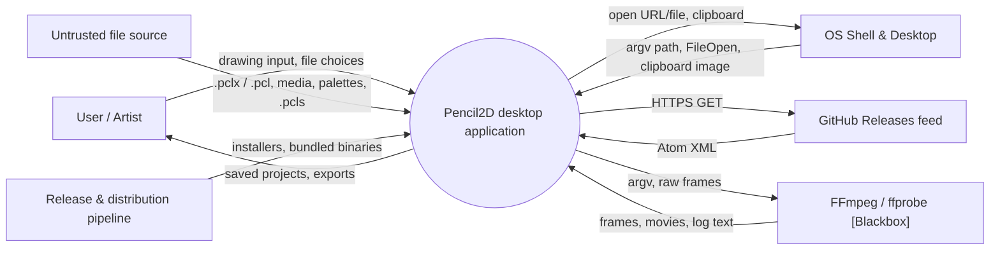
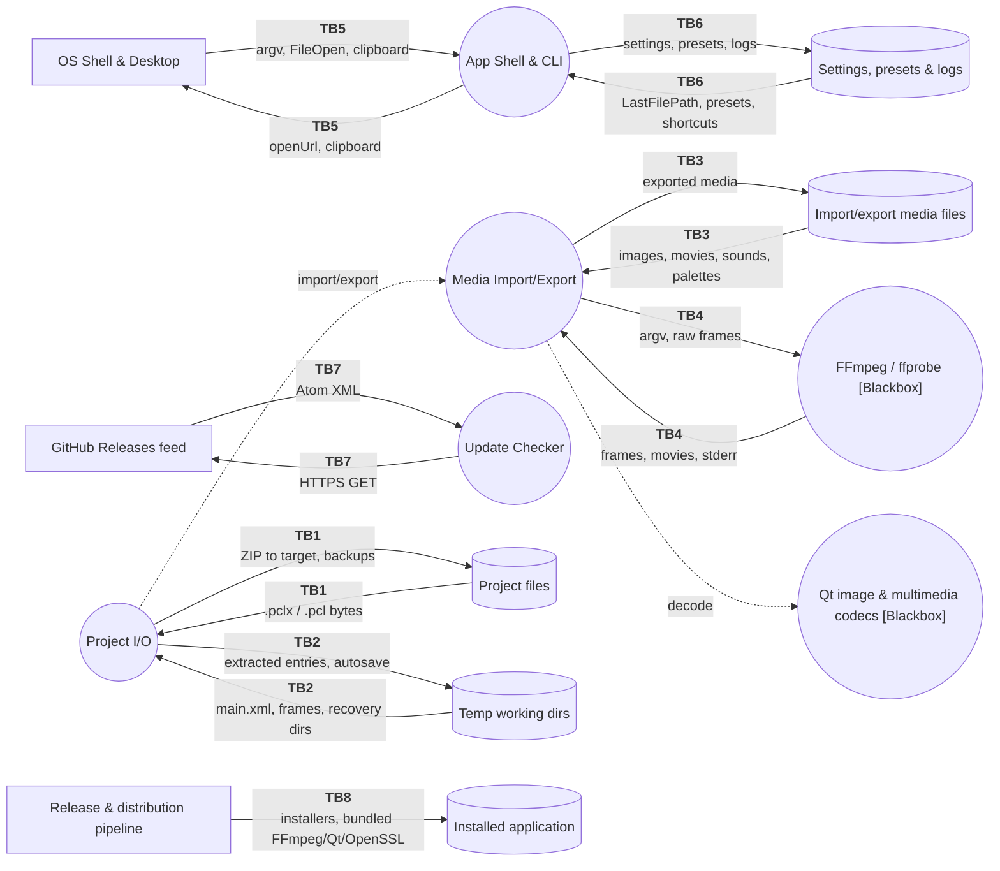

# Threat Model: Pencil2D Desktop Application (v0.7.0-dev)

**Source code analysis**: `report/pencil2d-code-analysis.md`

---

## 1. Template version

| **Date** | **Version** | **Changes** |
| -------- | ----------- | ----------- |
| 2026-09-23 | v1.2.0 (current) | STRIDE-per-TB tables (Left ↔ Data flow ↔ Right), AI-Prompt threat statements, Doomsday→STRIDE mapping, Open Questions (§5), question scoring in companion file. |

---

## 2. Model version

| **Date** | **Version** | **Changes** |
| -------- | ----------- | ----------- |
| 2026-09-23 | v1.0 | Initial STRIDE threat model of Pencil2D under the malicious-file attacker model. Status: **Draft — generated in one-shot mode, pending team review.** |

---

## 3. Documentation

### 3.1. Scope

> Carried from the code analysis report (§2).

**In scope**: project open/save/autosave/recovery (`.pclx` ZIP and legacy `.pcl`), media import/export (images, sequences, animated GIF/WebP, vector, movies, sounds, palettes, layers-from-project), the external FFmpeg/ffprobe process, the application shell (CLI, file associations, clipboard, `QDesktopServices`, dialogs), persistent state (QSettings, presets, `.pcls`, logs, single-instance lock), the update check, and the build/packaging/distribution pipeline.

**Out of scope**: internals of Qt image plugins, Qt Multimedia backends and FFmpeg decoders (treated as `[Blackbox]`); drawing tools and canvas painting; the pencil2d.org website and `get.pencil2d.org`; OS-level defences (SmartScreen, Gatekeeper, AppArmor).

### 3.2. Operational scenario

> A hobbyist or student animator downloads a `.pclx` project shared on a community forum, in a tutorial pack, or as a class assignment, and opens it in Pencil2D on a default Windows install. A second scenario: an artist imports an MP4 or a sound file received from a collaborator to rotoscope or add audio.

### 3.3. Background information

- **Code analysis report**: `report/pencil2d-code-analysis.md` (revision `1af647ebf`, full-depth scan, eight-category audit with a verified zip-slip harness result).
- Repository: `pencil2d/pencil`. Build: qmake (release) and CMake (dev). Container: single-process Qt 5.15 / 6.5 desktop app.

### 3.4. Assumptions

> Carried from the code analysis report (§3).

1. **Attacker model (anchor, Assumption #1)**: a **remote attacker with no local access** who gets the user to open a crafted project or import a crafted media/palette/shortcut file. The attacker controls every byte of the delivered file. This anchor is used consistently for all Likelihood scores. A local unprivileged user on a shared `/tmp` is a secondary attacker noted only where relevant.
2. Pencil2D runs unsandboxed with the logged-in user's privileges.
3. The Windows installer ships Qt 5.15.2 and installs per-user into `%LOCALAPPDATA%\Programs\Pencil2D`; `%TEMP%` is under `%LOCALAPPDATA%`.
4. FFmpeg/ffprobe, Qt image plugins and the Qt Multimedia backend are `[Blackbox]` and behave per their documentation and known CVE history.
5. The GitHub Atom feed and pencil2d.org are trusted over valid HTTPS.
6. Release builds come from qmake CI, so `QT_NO_DEBUG_OUTPUT` is defined in them.

### 3.5. Asset inventory

> Carried from the code analysis report (§5). Value definitions: **High** = disastrous/catastrophic if lost or compromised; **Medium** = significant/moderate; **Low** = insignificant/minor.

| **Asset ID** | **Name** | **Description** | **Value** |
| ------------ | -------- | --------------- | --------- |
| A1 | Project artwork & document data | The user's animation, in memory and as `.pclx`/`.pcl` with `.backupN` copies. | High |
| A2 | User account files & execution context | Everything the user can write, plus the ability to run code as the user. | High |
| A3 | Pencil2D installation & bundled executables | `pencil2d.exe`, Qt DLLs/plugins, `plugins/ffmpeg`. The Windows install dir is user-writable. | High |
| A4 | Temporary working directories & crash-recovery data | Extracted project, autosave output and crash leftovers under `%TEMP%/Pencil2D/`. | Medium |
| A5 | Application settings, presets & shortcuts | QSettings, `presets/*.pclx`, imported `.pcls`. Controls startup behaviour. | Low |
| A6 | Exported media outputs | Movies, GIF/APNG, sequences and palettes at user-chosen paths (FFmpeg `-y`). | Medium |
| A7 | Application availability | The ability to launch, open and work without crashes or hangs. | Medium |
| A8 | User credentials & confidential local files | The Windows NTLM credential; readable private files (SSH keys, documents). | High |
| A9 | Diagnostic information | Save-error log, dialog text and qDebug: paths, OS/kernel/locale, layer names. | Low |
| A10 | Release artifacts & signing credentials | Installers, AppImages, DMGs; bundled binaries; the Apple Developer ID and notarization secrets. | High |
| A11 | Update check information | Latest-version string and the fixed download URL. | Low |

### 3.6. Doomsday scenarios

> Worst-case business impact, used to calibrate the Impact dimension.

| **Doomsday ID** | **Description** | **Mapped to STRIDE** |
| ---------------- | --------------- | -------------------- |
| DD1 | A single "sample project" `.pclx` shared on a forum silently installs a persistent backdoor (Startup script or replaced `plugins\ffprobe.exe`) on every Windows user who opens it, turning the community file-sharing culture into a malware channel. | Elevation of Privilege / Tampering |
| DD2 | A crafted `.pclx` posted as a "broken file, please help" makes Pencil2D crash or hang on open, and crash-recovery re-offers it on every launch, so victims cannot start the app until they manually clear `%TEMP%`. | Denial of Service |
| DD3 | An artist opens a collaborator's legacy `.pcl`, unknowingly embeds their own SSH key (via a symlink), and sends the "finished" project back, leaking the credential; or a tampered unsigned Windows/Linux release reaches the whole user base. | Information Disclosure / Tampering |

**Discussion prompts**: Which of these would most damage Pencil2D's reputation and its file-sharing community? Are there any legal/privacy implications of DD3 credential leakage? How would the project detect that DD1 is happening in the wild, given there is no telemetry?

### 3.7. Data flow diagrams

> Carried from the code analysis report (§6). Reproduced here for cross-reference with the STRIDE tables.

#### 3.7.1. Context diagram

#### 3.7.2. Level 1 diagram

---

## 4. Threat identification (STRIDE)

> **How to read this section**: one STRIDE table per trust boundary, with a **Left ↔ Data flow ↔ Right** structure. V-mandated cells always contain analysis; `None identified — [reason]` means the category was analysed and no gap was found. `—` marks non-applicable (non-V) cells only. **Mitigations** are protections that exist in the code today; **Vulnerabilities** are gaps (cross-referenced to code-analysis findings F1–F41).

STRIDE-per-element applicability:

| | **S** | **T** | **R** | **I** | **D** | **E** |
|---|:---:|:---:|:---:|:---:|:---:|:---:|
| **External entity** | **V** | | **V** | | | |
| **Process** | **V** | **V** | **V** | **V** | **V** | **V** |
| **Data flow** | | **V** | | **V** | **V** | |
| **Data store** | | **V** | **(V)** | **V** | **V** | |

### 4.1. TB1: Project files ↔ Project I/O

> **What this boundary represents**: attacker-authored bytes (ZIP entry names, XML, media) cross into the process. The same channel writes the user's valuable saves back out. This is the single most important boundary in the system.

**Data**: `.pclx` (ZIP of `main.xml` + `data/` + `mimetype`) or legacy `.pcl` (XML + `.data/`); on save, the ZIP written onto the target plus `.backupN` copies.

**Notes**: Project I/O extracts before validating; keyframe `src` refs are confined by `validateDataPath`, but ZIP entry names and the legacy copy are not. Save is in-place, non-atomic.

**Open questions**: Q.1, Q.2, Q.5 (see §5).

| **TB1** | Left: **Project files** (data store) | | **Data flow** | | Right: **Project I/O** (process) | |
| --- | --- | --- | --- | --- | --- | --- |
| | Mitigations | Vulnerabilities | Mitigations | Vulnerabilities | Mitigations | Vulnerabilities |
| **Spoofing** | — | — | — | — | `mimetype` entry written on save; DOCTYPE checked | Format chosen by suffix only; `mimetype` never checked on load; DOCTYPE checked only after full parse (F33) |
| **Tampering** | ZIP CRC32 verified during extraction | No signature/MAC; any file the user can craft is accepted; CRC checked only after bytes hit disk (F17, F40) | ZIP CRC per entry | **Zip-slip: entry names write outside the working dir (F1); UNC entries reach attacker SMB (F6); legacy copy follows symlinks (F23)** | `validateDataPath` confines keyframe `src` (F40) | Entry names not validated before extraction; extraction precedes validation; numeric/enum attributes unchecked (F4, F5, F15) |
| **Repudiation** | — | — | — | — | Save-error log on failure | No record of successful extraction or out-of-dir writes; rejected paths only `qWarning` (F28); Windows error log likely fails (F29) |
| **Information disclosure** | File readable only by the user who has it | Legacy `.pcl` symlink copy pulls in and later embeds the user's private files (F23) | — | UNC entry can leak NTLM hash (F6) | `validateDataPath` blocks path traversal in `src` | Unescaped error details render attacker text as rich text (F24); diagnostics include paths (F30) |
| **Denial of service** | — | — | — | Zip bomb: no entry-count/size/ratio limits (F11) | — | `Q_UNREACHABLE` on bad layer type/easing (F4, F5); `fps=0` divide-by-zero (F9); `<projectdata>` infinite loop (F8); null derefs (F10); unbounded image/sound memory (F12, F13); persistent via recovery (F18) |
| **Elevation of privilege** | — | — | — | — | Runs as the user only | Zip-slip write to Startup or the user-writable install dir → code execution as the user (F1 → F2) |

#### Brainstorming Prompts for TB1
- If someone posts a "starter template" `.pclx` on the forum, what is the worst a single open can do before the user sees anything on screen?
- Should extraction be confined (reject `..`, absolute and UNC names) and validated before any byte is written to disk?
- Should opening a project be atomic and reversible, so a crash mid-save cannot destroy the only copy (F17)?
- Is there any value in signing the `mimetype`/manifest, or is confinement enough?

### 4.2. TB2: Project I/O ↔ Temp working dirs

> **What this boundary represents**: the in-process document meets a filesystem area that is shared on Linux `/tmp` and holds leftovers from other sessions and, potentially, other users or instances.

**Data**: extracted entries, keyframe/sound/palette files, timed-autosave output, rebuilt `main.xml`, and `*_Y2xD_*` recovery candidates.

**Notes**: working-dir names use `rand()` seeded with `time()`; `exists()`-then-`mkpath()` is not atomic; recovery trusts any matching directory.

**Open questions**: Q.3, Q.7.

| **TB2** | Left: **Project I/O** (process) | | **Data flow** | | Right: **Temp working dirs** (data store) | |
| --- | --- | --- | --- | --- | --- | --- |
| | Mitigations | Vulnerabilities | Mitigations | Vulnerabilities | Mitigations | Vulnerabilities |
| **Spoofing** | Recovery filters by `_Y2xD_` name and data-file presence | Recovery trusts any matching dir — no owner/PID/lock/marker; planted dir poses as the user's project (F7) | — | — | — | — |
| **Tampering** | Normal-failure cleanup removes the working dir | Adopts a foreign recovery dir as the working dir; `rebuildMainXML` trusts filenames (F18) | — | Zip-slip lands entries here and elsewhere (F1); another local user can pre-own the dir (F19) | umask perms | Predictable name + non-atomic create; symlink at top level followed by `removeRecursively` (F19) |
| **Repudiation** | — | — | — | — | — | Recovery deletions and adoptions not logged (F28) |
| **Information disclosure** | Windows/macOS temp is per-user | — | — | — | — | Linux `/tmp` dirs world-readable; project name in dir name; crash leftovers persist (F19) |
| **Denial of service** | — | Multi-instance recovery deletes a live instance's dir → data loss (F20) | — | Zip bomb fills the temp volume (F11) | — | Stale dirs never expired; leftovers accumulate (F18) |
| **Elevation of privilege** | Runs as the user only | Shared-`/tmp` symlink/TOCTOU lets a local user redirect writes/deletes (F19) | — | — | — | — |

#### Brainstorming Prompts for TB2
- On Linux, should the working dir move to a per-user `XDG_RUNTIME_DIR` / `CacheLocation` with `0700` instead of shared `/tmp`?
- Should recovery only offer directories owned by the current user and not currently locked by a live instance?
- Should a "loading" marker be written before parse and removed after, so a file that crashes on load is not re-offered forever (F18)?

### 4.3. TB3: Import/export media files ↔ Media Import/Export

> **What this boundary represents**: untrusted media, palette and layer files enter the process through the import menus; exports go to user-chosen paths.

**Data**: images, sequences, animated GIF/WebP, `.vec`, movies, sounds, palettes (`.gpl`/XML), other projects; exported images/movies/GIF/palettes.

**Notes**: decoders are chosen by content; no allocation or frame-count limits; Import Layers lacks a null check.

**Open questions**: Q.4.

| **TB3** | Left: **Import/export media files** (data store) | | **Data flow** | | Right: **Media Import/Export** (process) | |
| --- | --- | --- | --- | --- | --- | --- |
| | Mitigations | Vulnerabilities | Mitigations | Vulnerabilities | Mitigations | Vulnerabilities |
| **Spoofing** | — | — | — | — | File-dialog filters by extension | Decoder chosen by content sniffing, not the chosen type (F33) |
| **Tampering** | — | Any craftable media is accepted; no integrity check | — | Uninitialized heap pasted into artwork when decode fails (F12) | Import re-validates keyframe paths on project-load | Import Layers merges from a foreign working dir deleted mid-merge (F15) |
| **Repudiation** | — | — | — | — | — | Imports/overwrites not recorded (F28) |
| **Information disclosure** | — | — | — | — | — | Outdated image plugins may over-read on crafted headers (F3) |
| **Denial of service** | — | — | — | Oversized dimensions / frame counts (F12) | Movie frame cap (9999) and >200 prompt | Cap bypassed when duration is `N/A` (F14); animated import unbounded (F12); whole-sound-in-memory (F13) |
| **Elevation of privilege** | — | — | — | — | Runs as the user only | Decoder memory-safety bugs in outdated Qt/FFmpeg could execute code (F3) |

#### Brainstorming Prompts for TB3
- Should `QImageReader::setAllocationLimit` and a frame-count cap be set for all image and animated-image imports?
- Should the movie-import cap be enforced on the actual decoded frame count, not the claimed duration (F14)?
- Should a failed decode abort the import rather than paste a partial/uninitialized buffer (F12)?

### 4.4. TB4: Media Import/Export ↔ FFmpeg / ffprobe

> **What this boundary represents**: a separate executable is located by path and run with attacker-influenced input files; its text output is parsed.

**Data**: argv (`-i` input path, output path with `-y`, integer filter graph, sound-clip paths); raw BGRA frames on stdin; `Duration:`/`frame=` and encoded output back.

**Notes**: arguments are passed as a list (no shell); the binary is trusted by path; FFmpeg auto-detects input format.

**Open questions**: Q.4, Q.6.

| **TB4** | Left: **Media Import/Export** (process) | | **Data flow** | | Right: **FFmpeg / ffprobe [Blackbox]** (process) | |
| --- | --- | --- | --- | --- | --- | --- |
| | Mitigations | Vulnerabilities | Mitigations | Vulnerabilities | Mitigations | Vulnerabilities |
| **Spoofing** | Fixed relative path on Win/macOS | Identified by path + `QFile::exists` only; Linux `PATH` lookup; user-writable install dir (F2, F25) | — | — | — | No signature/hash check of the binary (F2) |
| **Tampering** | Args passed as a list (no shell); filter graph from integers (F40) | Output path from project base name only (safe) | — | Raw frame pipe has no backpressure (F26) | — | Replaced binary runs attacker code (F2) |
| **Repudiation** | — | — | — | — | — | No record of which binary ran or with what argv (F28) |
| **Information disclosure** | Canonical clip paths only | FFmpeg auto-detects format; a renamed HLS/concat playlist could read other local files / make network requests (F16) | — | stderr text rendered unescaped in ErrorDialog (F24) | — | Outdated FFmpeg 4.1.1 decoder exposure (F3) |
| **Denial of service** | — | Blocking 30 s waits on the GUI thread; timeout misreported as success (F26) | — | Silent process fills the write buffer (F26) | — | Crafted media can hang/crash FFmpeg (F14, F16) |
| **Elevation of privilege** | Runs as the user only | Binary planting via zip-slip → code execution (F1 → F2) | — | — | — | Decoder memory-safety bugs in FFmpeg 4.1.1 (F3, F16) |

#### Brainstorming Prompts for TB4
- Should the FFmpeg binary be verified (bundled path only, no `PATH` fallback; optional signature/hash check) before it is executed?
- Should imports pass `-f`/`-protocol_whitelist file` to stop playlist/network demuxers (F16)?
- How often is the bundled FFmpeg updated, and can the Windows 4.1.1 build be refreshed (F3)?

### 4.5. TB5: OS Shell & Desktop ↔ App Shell & CLI

> **What this boundary represents**: other applications (file managers, the clipboard, the browser) hand data to Pencil2D and receive URLs and files from it.

**Data**: argv path, `QFileOpenEvent` path, clipboard image; outbound `openUrl` and files.

**Notes**: file associations pass any path; clipboard images decode automatically; a runtime FileOpen can re-enter long operations.

**Open questions**: Q.8.

| **TB5** | Left: **OS Shell & Desktop** (external entity) | | **Data flow** | | Right: **App Shell & CLI** (process) | |
| --- | --- | --- | --- | --- | --- | --- |
| | Mitigations | Vulnerabilities | Mitigations | Vulnerabilities | Mitigations | Vulnerabilities |
| **Spoofing** | OS-registered file associations | An opened path's provenance is not checked (expected for a desktop app) | — | — | Single-instance `QLockFile` | Lock is release-only and user-bypassable (F20) |
| **Tampering** | — | — | — | — | — | Clipboard image decoded automatically on `dataChanged` (F32) |
| **Repudiation** | Files opened via association are user-initiated | User can deny which file they opened; no audit trail (F28) | — | — | — | — |
| **Information disclosure** | — | — | — | — | — | AboutDialog/ErrorDialog copy paths + system info to the clipboard (F30) |
| **Denial of service** | — | — | — | — | — | `QFileOpenEvent` during a long op frees the in-use document (F21) |
| **Elevation of privilege** | — | — | — | — | Runs as the user only | A planted `Documents/pencil2d_quick_guide.pdf` is opened instead of the bundled one (F38) |

#### Brainstorming Prompts for TB5
- Should clipboard images be decoded only on an explicit Paste, not on every `dataChanged` (F32)?
- Should a runtime FileOpen be deferred until no export/import/save is running (F21)?

### 4.6. TB6: App Shell & CLI ↔ Settings, presets & logs

> **What this boundary represents**: persistent per-user state that controls startup behaviour and stores diagnostic data.

**Data**: QSettings (RecentFiles, LastFilePath, LoadMostRecent, Shortcuts, Language, WindowState), `presets/*.pclx`, imported `.pcls`, `logs/error-*.txt`, the lock file.

**Notes**: settings are per-user; `.pcls` import is unvalidated; a preset is loaded through the full project loader.

**Open questions**: Q.9.

| **TB6** | Left: **App Shell & CLI** (process) | | **Data flow** | | Right: **Settings, presets & logs** (data store) | |
| --- | --- | --- | --- | --- | --- | --- |
| | Mitigations | Vulnerabilities | Mitigations | Vulnerabilities | Mitigations | Vulnerabilities |
| **Spoofing** | — | — | — | — | — | — |
| **Tampering** | Per-user store | `.pcls` copies all `[shortcuts]` keys incl. `@Variant` blobs, unvalidated (F34) | — | Presets/settings writable via zip-slip (F1) | — | A preset made default is loaded via the full project loader on every start (F34) |
| **Repudiation** | Save-error log written on failure | Log likely fails on Windows (`:` in name); no rotation (F29) | — | — | — | Setting changes not audited |
| **Information disclosure** | Per-user store | — | — | — | — | Error log holds paths, OS/kernel/locale, layer names (F30) |
| **Denial of service** | — | `LoadMostRecent` re-opens a crashing file on every start (F18) | — | — | — | — |
| **Elevation of privilege** | Runs as the user only | Default preset auto-load re-enters the vulnerable loader (F34 → F1/F4) | — | — | — | — |

#### Brainstorming Prompts for TB6
- Should `.pcls` import allow-list known shortcut keys and reject QDataStream blobs (F34)?
- Should a preset be validated (or opened read-only/sanitized) rather than run through the full loader (F34)?

### 4.7. TB7: Update Checker ↔ GitHub Releases feed

> **What this boundary represents**: the only network interaction — an HTTPS GET of a public Atom feed.

**Data**: HTTPS GET; Atom XML with the latest release title.

**Notes**: Qt default TLS (fail-closed); the display string comes from the feed; the download URL is fixed.

**Open questions**: Q.10.

| **TB7** | Left: **Update Checker** (process) | | **Data flow** | | Right: **GitHub Releases feed** (external entity) | |
| --- | --- | --- | --- | --- | --- | --- |
| | Mitigations | Vulnerabilities | Mitigations | Vulnerabilities | Mitigations | Vulnerabilities |
| **Spoofing** | HTTPS with Qt default cert verification (fail-closed); no `ignoreSslErrors` | No pinning; Windows Qt5 uses EOL OpenSSL 1.1.1w (F3, F37) | — | — | GitHub-hosted feed | — |
| **Tampering** | Fixed download URL; app never downloads/executes | Feed title shown in an AutoText QLabel (F24) | TLS integrity | A spoofed feed (if TLS broken) sets only the version string | GitHub TLS | — |
| **Repudiation** | — | — | — | — | Trusted GitHub feed | Network/TLS failure reason not surfaced (F28) |
| **Information disclosure** | — | — | TLS confidentiality | Reveals the app is running (minor) | — | — |
| **Denial of service** | — | Failure only hides the update prompt | — | — | — | — |
| **Elevation of privilege** | Runs as the user only | None identified — the app never acts on feed content beyond a version string | — | — | — | None identified — download is a fixed URL opened in the browser |

#### Brainstorming Prompts for TB7
- Is the EOL OpenSSL 1.1.1w on Windows Qt5 builds worth replacing or moving to Schannel (F3)?
- Should the update check ever surface a TLS failure to the user instead of failing silently?

### 4.8. TB8: Release & distribution pipeline ↔ Installed application

> **What this boundary represents**: third-party binaries and CI output become trusted code on every user's machine.

**Data**: installers, AppImage/zsync, DMG; bundled FFmpeg, OpenSSL, Qt, GStreamer; CI signing secrets.

**Notes**: macOS is signed/notarized; Windows and Linux are unsigned; several downloads are unpinned.

**Open questions**: Q.5.

| **TB8** | Left: **Release & distribution pipeline** (external entity) | | **Data flow** | | Right: **Installed application** (data store) | |
| --- | --- | --- | --- | --- | --- | --- |
| | Mitigations | Vulnerabilities | Mitigations | Vulnerabilities | Mitigations | Vulnerabilities |
| **Spoofing** | macOS codesign + notarize | Windows MSI/EXE and Linux AppImage unsigned; users cannot verify the publisher (F22) | — | — | — | — |
| **Tampering** | macOS Developer ID signing | Unpinned downloads (FFmpeg, OpenSSL, linuxdeploy, Okapi); RPM Fusion `--nogpgcheck`; Actions pinned by tag; `--privileged` container (F22) | HTTPS to sources | macOS FFmpeg GPG key fetched from the same host (F22) | — | Per-user install dir is user-writable (F2) |
| **Repudiation** | CI logs | Signing secrets available on every branch push; hard-coded temp keychain password (F22) | — | — | — | — |
| **Information disclosure** | — | — | — | — | — | Signing certificate/notarization secrets are High-value in CI (F22) |
| **Denial of service** | — | — | — | — | — | — |
| **Elevation of privilege** | — | — | — | A tampered dependency runs in every install (F22) | — | Bundled EOL/outdated binaries (FFmpeg 4.1.1, OpenSSL 1.1.1w, Qt 5.15.2) widen the attack surface (F3) |

#### Brainstorming Prompts for TB8
- Should Windows and Linux release artifacts be signed, and third-party downloads pinned by SHA?
- Should the bundled FFmpeg/OpenSSL/Qt be refreshed to supported versions on a schedule (F3)?
- Should signing run only on release refs, with a random keychain password (F22)?

### 4.9. STRIDE compliance verification

All V-mandated cells across TB1–TB8 contain analysis text or `None identified — [reason]`; no V-mandated cell is `—`. Element types: data stores (Project files, Temp dirs, Media files, Settings, Installed app) omit S and E; data flows carry only T/I/D; external entities (OS Shell, GitHub feed, Release pipeline) carry only S/R. None of the data stores handle audit data, so Repudiation is non-V (`—`) for them. Compliance: **PASS**.

### 4.10. Threat statements

> Following the AI-Prompt.md specification. One statement per Threat ID; structure: *"\<Threat actor\> with \<intent\> may \<action\> on \<asset\>, resulting in \<adverse impact\>."* To be validated by the team.

| **Threat ID** | **Threat Statement** | **Connected to DD?** | **Notes** |
| ------------- | -------------------- | -------------------- | --------- |
| T.1 | A remote attacker distributing a crafted project file with intent to gain persistence may write files outside the extraction directory on Pencil2D installation & bundled executables, resulting in catastrophic execution of attacker code as the user. | DD1 | Zip-slip (F1) enabling binary/Startup planting (F2). Elevation of Privilege. TB1/TB4. |
| T.2 | A remote attacker distributing a crafted project file with intent to run code may replace the bundled FFmpeg/ffprobe executable within Pencil2D installation & bundled executables, resulting in catastrophic execution of attacker code as the user on the next media operation. | DD1 | Path-only trust + user-writable install dir (F2). Spoofing. TB4. |
| T.3 | A remote attacker supplying a crafted media or project sound file with intent to exploit a decoder may deliver malformed input to Pencil2D installation & bundled executables (outdated FFmpeg/Qt/OpenSSL), resulting in catastrophic memory-corruption code execution. | DD1 | Outdated bundled decoders (F3, F16). Elevation of Privilege. TB3/TB4. |
| T.4 | A remote attacker distributing a crafted legacy project with intent to steal secrets may embed a symbolic link that copies user credentials & confidential local files into the saved project, resulting in disastrous disclosure of the user's private files. | DD3 | Legacy `.pcl` symlink copy (F23). Information Disclosure. TB1. |
| T.5 | A remote attacker distributing a crafted project file with intent to steal credentials may include a UNC extraction entry that connects to an attacker share from user credentials & confidential local files, resulting in disastrous disclosure of the user's NTLM authentication hash. | DD3 | UNC zip entry (F6). Information Disclosure. TB1. |
| T.6 | A remote attacker distributing a crafted project file with intent to deny service may set an invalid layer type, camera easing, frame rate, or malformed projectdata on project artwork & document data, resulting in significant loss of application availability through a crash, undefined behaviour, or infinite loop on open. | DD2 | F4, F5, F8, F9, F10. Denial of Service. TB1. |
| T.7 | A remote attacker distributing a crafted project file with intent to persistently deny service may leave a crashing project in the temporary working directories & crash-recovery data, resulting in significant loss of application availability as recovery re-offers it on every launch. | DD2 | Recovery persistence (F18) + LoadMostRecent (F34). Denial of Service. TB2/TB6. |
| T.8 | A remote attacker distributing a crafted project file with intent to exhaust resources may include a decompression bomb or oversized media in project artwork & document data, resulting in significant loss of application availability and temporary storage exhaustion. | DD2 | Zip bomb / unbounded image, sound, movie (F11–F14). Denial of Service. TB1/TB2/TB3. |
| T.9 | A remote attacker planting a directory in the temporary working directories & crash-recovery data with intent to deceive may present it as the user's unsaved project, resulting in moderate compromise as attacker-authored content is opened and saved as the user's own work. | DD3 | Recovery trust (F7). Spoofing. TB2. |
| T.10 | A local unprivileged user with intent to tamper may pre-own or symlink the shared-temp working directories & crash-recovery data, resulting in moderate disclosure or destruction of the victim's project artwork & document data. | DD3 | Shared `/tmp` TOCTOU/symlink (F19). Tampering. TB2. Secondary attacker. |
| T.11 | A remote attacker distributing a crafted project file with intent to spoof or phish may inject rich-text markup through layer names or error details into diagnostic information dialogs, resulting in minor deception of the user. | — | Unescaped rich text (F24). Tampering/Spoofing. TB1/TB5. |
| T.12 | An attacker who can write to the clipboard with intent to attack image decoders may push a crafted image that Pencil2D automatically decodes into application availability, resulting in minor loss of availability through a decoder crash. | — | Auto-decode on `dataChanged` (F32). Tampering. TB5. |
| T.13 | A supply-chain attacker with intent to compromise the user base may tamper with unsigned Windows or Linux release artifacts or an unpinned build dependency in the installed application, resulting in catastrophic distribution of attacker code to all users. | DD3 | Unsigned/unpinned distribution (F22). Tampering. TB8. |
| T.14 | A remote attacker supplying a crafted project to an unattended command-line export with intent to deny service may set an extreme frame range or camera dimensions on project artwork & document data, resulting in significant storage exhaustion and a non-terminating export. | DD2 | CLI unbounded range/size (F15). Denial of Service. TB1/TB5. |
| T.15 | A remote attacker whose crafted project triggers a long operation with intent to corrupt data may cause a re-entrant autosave or a macOS FileOpen to run against project artwork & document data mid-operation, resulting in significant corruption or loss of the saved project. | DD2 | Re-entrancy/autosave (F21, F27). Tampering. TB5. |

---

## 5. Open Questions

| **Question ID** | **Description** |
| --------------- | --------------- |
| Q.1 | Confirm the zip-slip → code-execution chain end-to-end on a shipped Windows install (Qt 5.15.2), including whether `_wfopen_s` resolves `..` as expected (F1, F2). |
| Q.2 | Determine what MSVC 2019 generates for the `Q_UNREACHABLE` switches (`object.cpp:100`, `layercamera.cpp:204`): a bounds-checked jump table, or a wild pointer/jump. This sets whether F4/F5 are crash-only or exploitable. |
| Q.3 | Should crash recovery restrict itself to directories owned by the current user and not held by a live instance, and skip files that crashed during load (F7, F18, F19)? |
| Q.4 | Which Qt imageformat plugins and Qt Multimedia backends are deployed per platform and in which versions, and can the bundled FFmpeg reach HLS/concat demuxers from a renamed input (F3, F12, F16, F33)? |
| Q.5 | Are Windows installers signed out-of-band before publishing, and are the `pencil2d-deps` release assets immutable and access-controlled (F22)? |
| Q.6 | Does Qt 5.15's `QDomDocument::setContent(QIODevice*)` reopen a closed file, i.e. does the recovery always-rebuild path (F18b) affect Windows builds too? |
| Q.7 | Is Pencil2D distributed as a Flatpak/Snap on Linux (private `/tmp`), which would mitigate F19? |
| Q.8 | Is a `QFileOpenEvent` delivered during a window-modal progress dialog on macOS in the shipped Qt versions (F21)? |
| Q.9 | When the default-preset option is enabled, is the preset loaded automatically on startup/New without a prompt, making F34 persistence automatic? |
| Q.10 | Do the shipped Qt builds render `` in ErrorDialog/QMessageBox rich text, enabling remote/UNC resource loading from F24? |

> **Note**: Questions are scored in the companion file `pencil2d-threat-scoring-suggestion.md` using worst-case assumptions for the unknowns.

---

## 6. Threat scoring

> Reserved for the security engineers. AI-generated scoring suggestions are in the companion file `pencil2d-threat-scoring-suggestion.md`.

**Scoring method**:
- **Threats**: light Likelihood × Impact matrix.
- **Vulnerabilities**: CVSS v4.0 for severity, kept distinct from L×I.
- **Questions**: worst-case estimate for the unknowns; lower after investigation.

### Risk Matrix

| | Very unlikely | Not likely | Likely | Very likely | Extremely likely |
|---|---|---|---|---|---|
| **Extreme** | 5 | 10 | 15 | 20 | 25 |
| **Severe** | 4 | 8 | 12 | 16 | 20 |
| **Substantial** | 3 | 6 | 9 | 12 | 15 |
| **Moderate** | 2 | 4 | 6 | 8 | 10 |
| **Slight** | 1 | 2 | 3 | 4 | 5 |

| Score Range | Level | Color |
|-------------|-------|-------|
| 16–25 | Very high risk | Red |
| 11–15 | High risk | Orange |
| 6–10 | Moderate risk | Yellow |
| 1–5 | Low risk | Green |

### Scoring Table

*To be filled by security engineers.*

| **Threat ID / Question ID** | **Score** | **Tracking** | **Notes** |
| --------------------------- | --------- | ------------ | --------- |
| T.1 | | | |
| T.2 | | | |
| T.3 | | | |
| T.4 | | | |
| T.5 | | | |
| T.6 | | | |
| T.7 | | | |
| T.8 | | | |
| T.9 | | | |
| T.10 | | | |
| T.11 | | | |
| T.12 | | | |
| T.13 | | | |
| T.14 | | | |
| T.15 | | | |
| Q.1 | | | |
| Q.2 | | | |
| Q.3 | | | |
| Q.4 | | | |
| Q.5 | | | |
| Q.6 | | | |
| Q.7 | | | |
| Q.8 | | | |
| Q.9 | | | |
| Q.10 | | | |

---

## 7. Evaluation

- **What went well**: A full-depth code analysis with per-category audits gave broad, deterministic coverage, and the zip-slip finding was confirmed with a harness rather than left as a hypothesis. The threat model reuses that evidence directly.
- **Lessons**: The dominant risk is a classic one for desktop file parsers — an unconfined archive extractor combined with a user-writable install location. Several crash/hang bugs share one root cause (no validation of numeric/enumerated attributes and no resource limits), so they can be addressed together.
- **Process improvements**: Add a ZIP path-traversal regression test and a fuzz harness for the project, `.vec`, palette and ZIP parsers. Re-run this model once extraction confinement, input-range validation and resource limits are in place, and after the bundled FFmpeg/Qt/OpenSSL are refreshed.
- **Draft caveat**: generated in one-shot mode. Exploitability items (Q.1, Q.2, Q.6, Q.8, Q.10) need dynamic confirmation before final severities are set.

---

## Appendix A: Mitigations

> Backlog-ready actions from the STRIDE analysis. Owner and Due are TBD.

| # | Threat | Control Type | Action | Owner | Due | Definition of Done |
|---|--------|--------------|--------|-------|-----|--------------------|
| M1 | T.1 | Prevent | In `MiniZ::uncompressFolder`, reject entry names that are absolute, contain `..`, start with `/` or `\`, or are UNC; canonicalize each target and verify it stays under the working dir before writing; validate before extracting any byte. | TBD | TBD | A ZIP with `../`, absolute, backslash and UNC entries extracts nothing outside the working dir; regression test in `test_qminiz.cpp` passes. |
| M2 | T.2 | Prevent/Detect | Load FFmpeg/ffprobe only from the bundled `plugins/` path (no `PATH` fallback in packaged builds); optionally verify a signature/hash. Consider a non-user-writable install location, or integrity-check own binaries at launch. | TBD | TBD | Movie import/export refuses to run a binary outside the bundle; documented. |
| M3 | T.3 | Prevent | Refresh bundled FFmpeg (Windows 4.1.1 → current), Qt (5.15.2 → supported) and OpenSSL (1.1.1w → supported); pin and hash-verify each download. | TBD | TBD | Bundled versions are current-supported; CI verifies checksums. |
| M4 | T.3, T.8 | Prevent | For image import, set `QImageReader::setAllocationLimit`, cap dimensions, validate before allocating, and abort import on a failed decode instead of pasting. Pass `-protocol_whitelist file` / `-f` to FFmpeg imports. | TBD | TBD | Oversized images are rejected; a failed decode adds no keyframe; playlist demuxers are unreachable. |
| M5 | T.4, T.5 | Prevent | Use `QDir::NoSymLinks` in the legacy `.pcl` copy and refuse symlinked entries; keep UNC/absolute rejection from M1 for legacy paths. | TBD | TBD | A `.pcl.data` with a symlink to an outside file copies nothing; test passes. |
| M6 | T.6 | Prevent | Replace `Q_UNREACHABLE`/`Q_ASSERT` on file-derived layer type and camera easing with graceful validation; clamp `fps` to ≥1; fix the `<projectdata>` sibling-advance loop; add null checks (vector frame, Import Layers). | TBD | TBD | Fuzz corpus of malformed `main.xml` produces user-facing errors, never crashes/hangs/UB. |
| M7 | T.7, T.9 | Prevent/Detect | Restrict recovery to current-user-owned, non-locked directories; write a "loading" marker before parse and clear it after, so a load-crash file is not re-offered; confirm the deletion target on Discard. | TBD | TBD | A planted or foreign temp dir is not offered; a file that crashes on load is not re-offered. |
| M8 | T.8, T.14 | Prevent | Cap ZIP entry count/total uncompressed size/ratio; enforce the movie cap on decoded frames; bound CLI frame range and export dimensions. | TBD | TBD | A zip bomb and an extreme frame range are rejected with an error. |
| M9 | T.10 | Prevent | On Linux, create working dirs under a per-user `0700` location (`XDG_RUNTIME_DIR`/`CacheLocation`) with `QTemporaryDir`-style unpredictable names; drop `srand(time())`. | TBD | TBD | Working dirs are not world-readable and cannot be pre-owned by another user. |
| M10 | T.11 | Prevent | Escape untrusted text (layer names, entry names, FFmpeg output) before it reaches rich-text widgets; use `Qt::PlainText` or `toHtmlEscaped()`; disable `openExternalLinks` where not needed. | TBD | TBD | Crafted layer names render literally, with no markup or resource loading. |
| M11 | T.13 | Prevent/Detect | Sign Windows and Linux release artifacts; pin third-party Actions and downloads by SHA; gate signing on release refs; use a random keychain password. | TBD | TBD | Released installers are signed; dependencies are hash-pinned; secrets are not exposed on PR builds. |
| M12 | T.15 | Prevent | Make save atomic (write to a temp file, then rename); fix the backup-name/collision logic; do not delete the backup until the new file is verified. Defer autosave and runtime FileOpen while a long operation runs. | TBD | TBD | A crash mid-save leaves either the old or the new file intact; no re-entrant save during import/export. |
| M13 | T.12 | Prevent | Decode clipboard images only on an explicit Paste, not on every `dataChanged`. | TBD | TBD | Copying an image elsewhere does not make Pencil2D decode it. |

### Resolution Decisions
| # | Threat | Decision | Rationale |
|---|--------|----------|-----------|
| T.1 | Zip-slip → code execution | Mitigate | Highest-impact, low-cost fix; confinement is standard practice. |
| T.2 | FFmpeg binary planting | Mitigate | Removes the persistence sink that amplifies T.1. |
| T.3 | Outdated decoders | Mitigate | Refresh + hardening reduce a broad memory-safety surface. |
| T.4, T.5 | Symlink / UNC disclosure | Mitigate | Cheap parser changes close credential-leak paths. |
| T.6, T.8, T.14 | Crash/DoS/exhaustion | Mitigate | Shared root cause; input validation and limits. |
| T.7, T.9, T.10 | Recovery/temp abuse | Mitigate | Ownership checks and per-user temp. |
| T.11, T.12, T.15 | Injection / re-entrancy / clipboard | Mitigate | Standard escaping, atomic save, explicit paste. |
| T.13 | Supply chain | Mitigate | Signing and pinning; some parts depend on project infrastructure. |

---

## Appendix B: Discussion Topics

### Open Questions
- All Q.1–Q.10 from §5, especially the exploitability of the `Q_UNREACHABLE` paths (Q.2) and the FFmpeg demuxer reach (Q.4).

### Suggested Brainstorming Areas
- Whether project extraction should move to a hardened, well-tested library routine and be fuzzed continuously.
- Whether Pencil2D should ship as a sandboxed package (Flatpak/Snap/MSIX) to contain file-parsing bugs.
- How the project would detect DD1-style abuse in the wild given the deliberate lack of telemetry.

### Verification Items
- [ ] Confirm zip-slip write and binary planting on a real Windows install (Q.1).
- [ ] Disassemble the `Q_UNREACHABLE` switches in a release build (Q.2).
- [ ] Enumerate deployed Qt image plugins and Multimedia backend versions per platform (Q.4).
- [ ] Confirm whether Windows release installers are signed out-of-band (Q.5).
- [ ] Test rich-text `` loading in the shipped ErrorDialog (Q.10).

---

## Appendix C: Outcome

### Current State Assessment
Under the malicious-file attacker model, Pencil2D's project loader is the dominant risk. An unconfined ZIP extractor (F1) combined with a user-writable per-user install location (F2) forms a plausible open-a-file-to-run-code chain, confirmed for the traversal half with a harness and pending dynamic confirmation for the execution half. A cluster of crash/hang/UB bugs is reachable from single `main.xml` attributes and can be made persistent by crash recovery. Outdated bundled decoders (FFmpeg 4.1.1, Qt 5.15.2, OpenSSL 1.1.1w) widen the memory-safety surface. Positives: keyframe path confinement is correct and tested, XML entity attacks do not work, and FFmpeg arguments are passed without a shell. This is a **draft** pending team review and the dynamic checks in §5.

### Follow-up Actions
- Prioritise M1 (extraction confinement) and M6 (input validation) for the next release; both are low-cost and close the highest-severity threats.
- Schedule M3 (dependency refresh) and M11 (release signing), which depend on project infrastructure.
- Re-run this threat model after M1, M6, M8 land and after the bundled dependencies are refreshed.

### Linked Tickets
| Ticket | Description | Status |
|--------|-------------|--------|
| TBD | Zip-slip confinement in `MiniZ::uncompressFolder` | Open |
| TBD | Validate/clamp file-derived layer type, easing, fps; fix projectdata loop | Open |
| TBD | Refresh bundled FFmpeg / Qt / OpenSSL | Open |

---

## Appendix D: Supplementary Analysis

> `system_wide_vulnerabilities` and `architecture_design_flaws` are `off` (default), so extended findings are recorded here.

### D.1. System-wide vulnerabilities

| **SW ID** | **Title** | **Description** | **Affected Components** | **Potential Impact** | **Severity Estimate** |
| --------- | --------- | --------------- | ----------------------- | -------------------- | --------------------- |
| SW.1 | Unconfined archive extraction | ZIP entry names become filesystem paths with no containment, so one crafted file writes anywhere the user can (F1, F6). See TB1 → Project I/O → Tampering `[→ SW.1]`. | Project I/O, Temp dirs, whole user account | Arbitrary file write → persistence/code execution | Critical |
| SW.2 | Path-only trust of executables in a user-writable install | FFmpeg/ffprobe and Qt plugins are trusted by path in a per-user-writable install dir (F2, F25). See TB4 → FFmpeg → Spoofing `[→ SW.2]`. | Installed app, Media I/O, FFmpeg | Code execution as the user | High |
| SW.3 | Outdated bundled decoder stack | FFmpeg 4.1.1, Qt 5.15.2 and OpenSSL 1.1.1w parse attacker data with known later-fixed CVEs (F3). | Installed app, Media I/O, Update Checker | Memory-corruption code execution; broken TLS | High |
| SW.4 | No input hardening across parsers | No range/enum validation, resource limits or fuzzing for `main.xml`, `.vec`, palette and ZIP (F4–F15, F31, F35). | Project I/O, Media I/O | Crash/hang/UB DoS, some possibly exploitable | High |
| SW.5 | Recovery/temp trust and shared `/tmp` | Recovery trusts any matching dir and adopts foreign/shared directories with predictable names (F7, F18–F20). | Project I/O, App Shell, Temp dirs | Spoofed content, data loss, local tampering | Medium |
| SW.6 | Unsigned, unpinned distribution | Windows/Linux artifacts unsigned; several build inputs unpinned; broad CI secret exposure (F22). | Release pipeline, Installed app | Whole-user-base compromise via a tampered release | Medium |
| SW.7 | Minimal audit trail | Successful extraction, FFmpeg execution, overwrites and recovery deletions are not recorded; the one file log is likely broken on Windows (F28, F29). | All components | Incidents cannot be detected or reconstructed | Low |

### D.2. Architecture design considerations

| **AD ID** | **Title** | **Description** | **Affected Components** | **Potential Impact** | **Design Recommendation** |
| --------- | --------- | --------------- | ----------------------- | -------------------- | ------------------------- |
| AD.1 | Non-atomic in-place save | The ZIP is written straight onto the target with defective backup logic and no verify (F17). | Project I/O, Project files | Silent loss/corruption of the only copy | Write to a temp file and rename; fix backup naming; verify before deleting the backup. |
| AD.2 | Event-loop re-entrancy during long operations | `processEvents`/modal progress dialogs let autosave, timers and macOS FileOpen mutate or free the document mid-operation (F21, F27). | App Shell, Project I/O, Media I/O | Use-after-free, partial saves | Run long operations off the GUI thread or block re-entrant document mutation. |
| AD.3 | Unbounded in-memory frame and undo growth | The frame-pool floor and undo step-count cap ignore byte size (F35). | Project I/O | Memory exhaustion on large/crafted projects | Enforce a real byte budget on the frame pool and undo history. |
| AD.4 | Crash leftovers never expired | Temp working dirs and crash debris are never swept or aged (F18, F19). | Temp dirs | Sensitive artwork left in temp; recovery clutter | Sweep stale `*_Y2xD_*` dirs on startup with an age/ownership check. |
| AD.5 | Single-threaded FFmpeg interaction blocks the UI | 30 s blocking waits on the GUI thread, with timeouts misreported as success (F26). | Media I/O, FFmpeg | UI freezes; partial output reported as OK | Move process I/O off the GUI thread; check `exitStatus()` correctly. |
